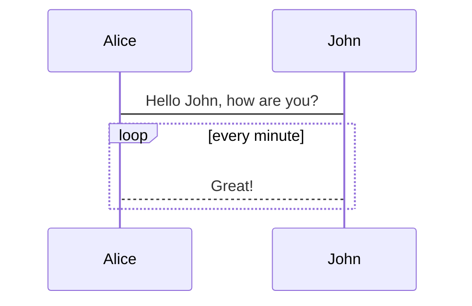

# Homepage

Set up you markdown files site in one minute, powered by [Docsify](https://docsify.js.org/).

Your :star: will be high praise for my efforts, thank you!

Demo is here: [Maxlinn's Docsify Template Demo](https://maxlinn.site/linn-docsify-template).

## Usage

- Use this repository as template.
  - You'll get a `main` branch with those files
    - `index.html`, settings, **must modify, at least modify `!!!` commented settings**.
    - `README.md`, default page of your site, **change it to yours**.
    - `.nojekyll`, ignore it.
    - `_navbar.md, _sidebar.md, _footer.md`, **change it yo yours**. Remove any if you don't like.
    - Folder `a-great-subfoloder`, just for demo, **remove it and its contents**.
  - That's all, docsify is just as simple as it.
- Go to repository settings, set `github pages` work on `main` branch.

## Reminder

- Every `README.md` will serve as the default page of this folder level, including this one. 
  - So don't hesitate to delete this `README.md` to create your own homepage!
- The sidebar serve as a document navigator as well as `table of contents(toc)` of current document.
  - The sidebar item starts with an `-` is the toc of active document, auto-generated.
  - Sidebar item can by any link, defined in `_sidebar.md`.

## Features

- Full text search.
  - Implement by frontend. Discover documents by hyperlinks in the document you viewed(like a web spider), **not always contains all documents in valut**, and **search index refreshes every one day**.
- Dark Mode.
- LaTeX, mermaid.js, code highlight support.
- Custom font settings.
- User experience enhancement.
  - Copy code button.
  - Pangu, add Space to Chinese and English overlap.
  - Collapsable nested sidebar.
- Support tab syntax, see examples in syntax test below.

## Markdown Syntax Test

~~deleted~~

==hightlight==

$a^2+b^2=c^2$

$$
a^2+b^2=c^2
$$

:star:



```python
for i in range(42):
    print("calm down")
```

```markdown
<!-- tabs:start -->
#### **English**
Hello!
#### **French**
Bonjour!
#### **Italian**
Ciao!
<!-- tabs:end -->
```

<!-- tabs:start -->
#### **English**
Hello!
#### **French**
Bonjour!
#### **Italian**
Ciao!
<!-- tabs:end -->